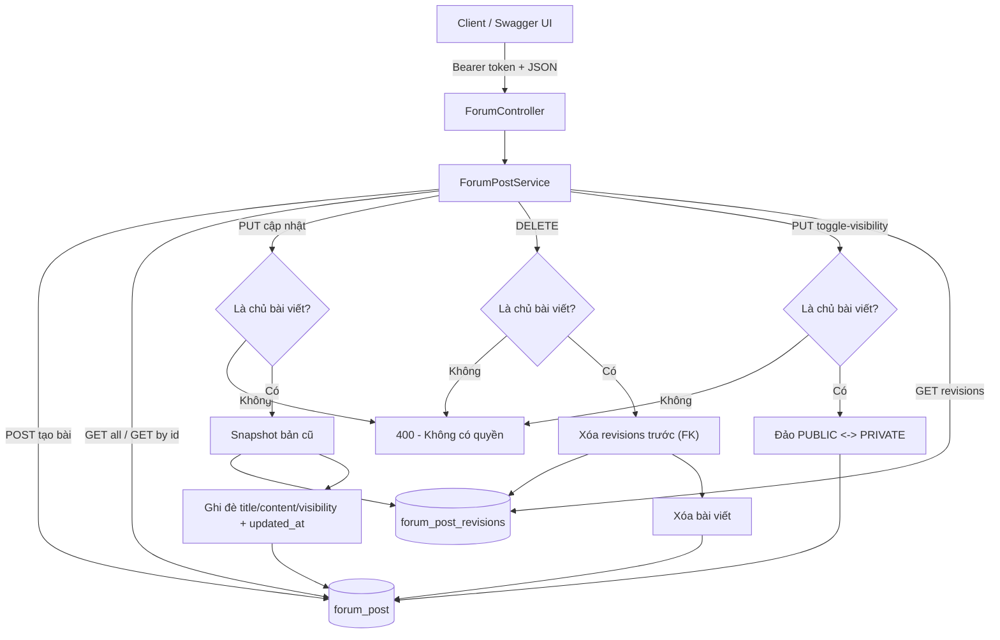
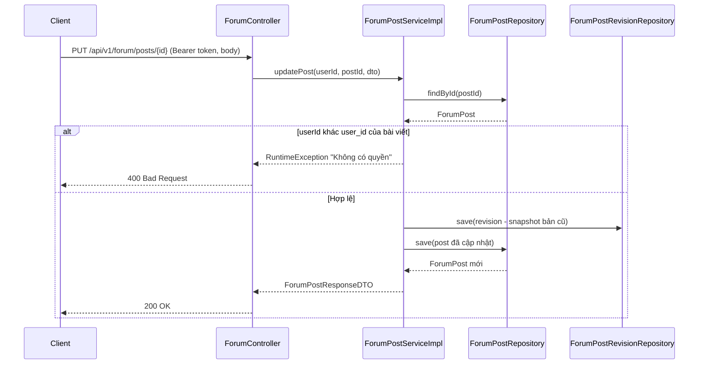

# Forum API — Tài liệu & Luồng xử lý

Module Forum xây dựng trên 2 bảng có sẵn `forum_post` và `forum_post_revisions` (**không thay đổi schema**). Mỗi lần cập nhật bài viết, phiên bản cũ được lưu tự động vào `forum_post_revisions`.

Base URL: `/api/v1/forum/posts` — hiển thị trên Swagger UI (`/swagger-ui.html`) cùng nhóm với các controller khác, dùng chung Bearer JWT (`bearerAuth`): login → dán token vào nút Authorize là đủ.

## Danh sách API (tổng cộng 7 API)

| # | Method | Endpoint | Mô tả | Yêu cầu đăng nhập |
|---|--------|----------|-------|-------------------|
| 1 | POST   | `/api/v1/forum/posts` | Tạo bài viết mới | Có (Bearer token) |
| 2 | GET    | `/api/v1/forum/posts/all` | Lấy tất cả bài viết (ghim trước, mới nhất trước) | Không |
| 3 | GET    | `/api/v1/forum/posts/{id}` | Xem chi tiết bài viết | Không |
| 4 | PUT    | `/api/v1/forum/posts/{id}` | Cập nhật bài viết (tự lưu bản cũ vào revisions) | Có (Bearer token) |
| 5 | DELETE | `/api/v1/forum/posts/{id}` | Xóa bài viết + toàn bộ revisions | Có (Bearer token) |
| 6 | PUT    | `/api/v1/forum/posts/{id}/toggle-visibility` | Đảo trạng thái hiển thị PUBLIC ↔ PRIVATE | Có (Bearer token) |
| 7 | GET    | `/api/v1/forum/posts/{id}/revisions` | Xem lịch sử chỉnh sửa của bài viết | Không |

> User được lấy **ngầm từ JWT token** qua `SecurityContextHolder` (giống `DocumentServiceImpl`), không dùng header `X-User-Id`. Tên hiển thị (`user_name`) lấy tự động từ `customer_profiles.full_name` (không có thì dùng email).

## Request / Response mẫu

### 1. Tạo bài viết — `POST /api/v1/forum/posts`

Request body (`ForumPostRequestDTO`):

```json
{
  "documentId": "9c1b2f3a-...-uuid (tùy chọn)",
  "title": "Chia sẻ tài liệu ôn SWP391",
  "content": "Nội dung bài viết...",
  "visibility": "PUBLIC"
}
```

Response (`ForumPostResponseDTO`) — mặc định `status = ACTIVE`, `isPinned = false`:

```json
{
  "id": "uuid",
  "documentId": "uuid | null",
  "userId": "uuid",
  "userName": "Nguyễn Trọng Tín",
  "visibility": "PUBLIC",
  "title": "Chia sẻ tài liệu ôn SWP391",
  "content": "Nội dung bài viết...",
  "status": "ACTIVE",
  "isPinned": false,
  "createdAt": "2026-07-05T08:00:00Z",
  "updatedAt": "2026-07-05T08:00:00Z"
}
```

### 4. Cập nhật bài viết — `PUT /api/v1/forum/posts/{id}`

Body giống khi tạo (trường nào null thì giữ nguyên giá trị cũ). Chỉ **chủ bài viết** (user trong token trùng `user_id`) mới được sửa. Trước khi ghi đè, hệ thống snapshot title/content/status cũ vào `forum_post_revisions` kèm `edited_by`, `edited_by_name`, `revision_no`.

### 6. Xem revisions — `GET /api/v1/forum/posts/{id}/revisions`

Response: mảng `ForumPostRevisionResponseDTO`, sắp xếp mới nhất trước:

```json
[
  {
    "id": "uuid",
    "postId": "uuid",
    "revisionNo": "uuid",
    "title": "Tiêu đề phiên bản cũ",
    "content": "Nội dung phiên bản cũ",
    "status": "ACTIVE",
    "editedBy": "uuid",
    "editedByName": "Nguyễn Trọng Tín",
    "createdAt": "2026-07-05T09:00:00Z"
  }
]
```

### Lỗi thường gặp

| HTTP | Nguyên nhân |
|------|-------------|
| 400 | Tiêu đề/nội dung trống, không tìm thấy bài viết, không có quyền sửa/xóa |

## Diagram luồng xử lý

### Luồng tổng quan CRUD + Revision



### Sequence diagram — Cập nhật bài viết (luồng quan trọng nhất)



## Các file đã thêm / sửa

| File | Loại |
|------|------|
| `entity/ForumPost.java`, `entity/ForumPostRevision.java` | Entity (map đúng schema, không sửa bảng) |
| `repository/ForumPostRepository.java`, `repository/ForumPostRevisionRepository.java` | Repository |
| `dto/request/ForumPostRequestDTO.java` | DTO request |
| `dto/response/ForumPostResponseDTO.java`, `dto/response/ForumPostRevisionResponseDTO.java` | DTO response |
| `service/ForumPostService.java`, `service/impl/ForumPostServiceImpl.java` | Service |
| `controller/ForumController.java` | Controller (Swagger annotations giống các controller khác) |
| `security/SecurityConfig.java` | Thêm `/api/v1/forum/**` vào PUBLIC_PATHS (giống `/api/v1/documents/**`) |
